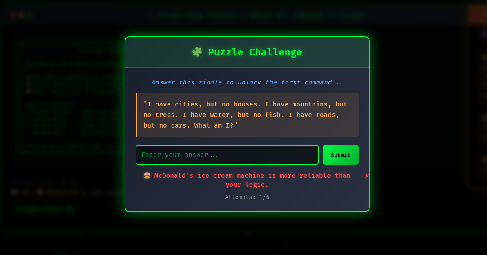

# Command-line Escape Room interface with locked commands 🎯

## Basic Details
### Team Name: The One

### Team Members
- Team Lead: Aidan Jaison - Muthoot Institute of Technology and Science

### Project Description
Here's a command line, but not your regular Linux command line. Here, you've to unlock each command. You can't just use the "cd" command or the "ls" command as you wish, you have to solve a riddle to be able to use those commands and finally escape the room. That doesn't mean that the AI would leave you alone easy, it would roast you for getting it wrong too.

### The Problem (that doesn't exist)
The problem that didn't exist that I made up is that you can't easily access the command line and use it as you please. (Not making life any easier)

### The Solution (that nobody asked for)
The solution that I proposed for the problem I created is that you've to manually earn the right to use each commands. You have to solve a riddle when you try to implement a command in your knowledge. The roasts by the AI will help you lighten up the mood and try again. Only by solving the riddle can you use the command in the command line interface and escape the room.

## Technical Details

### Technologies/Components Used
For Software:
- **HTML5**: Semantic structure and accessibility
- **CSS3**: Advanced styling, animations, and responsive design
- **Vanilla JavaScript**: No dependencies, pure ES6+ code
- **LocalStorage**: Client-side state persistence
- **Web Audio API**: Sound effects

### Implementation
For Software:
- In any modern web browser, run the "index.html" file.

# Run

### Project Documentation
For Software:

# Screenshots

This is the homepage of the whole command interface where you are able to input basic unix commands.

## Screenshot 2

Here's the first riddle for unlocking one of the unix commands.

## Screenshot 3

If you guessed it wrong, then BAAM!, get roasted by ARTIFICIAL INTELLIGENCE

## Screenshot 4

But if you did guess it right, you have this and congrats, you've unlocked one command out of the 10 to be unlocked

## Screenshot 5

The command line interface after you've done guessing a few riddles an unlocking commands.

### Project Demo
# Video

The video demonstrates the total working of the terminal interface/escape room. Here, there are basic commands like "cd" and "ls" used. To unlock them and finally leave the escape room,, you've to solve the riddle. The video gives us the general working of the interface and the answers to a few riddles given. If not answered correctly, the AI roasts you. You can refer the escape-status for the remaining commands to be unlocked. 

# Additional Demos

## Team Contributions
- Aidan Jaison - All

---
Made with ❤️ at TinkerHub Useless Projects 

